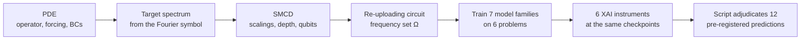
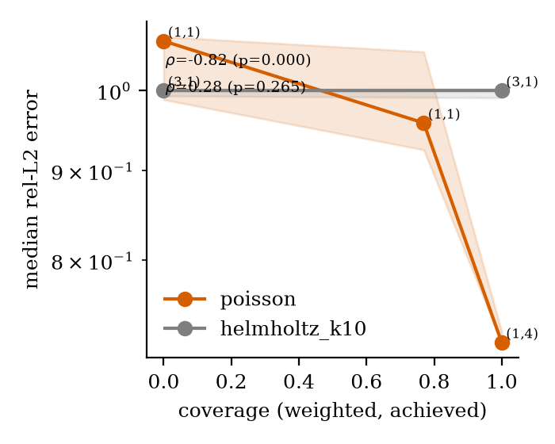

# QAPINN-Spectra

[](https://github.com/Mannava-Daasaradhi/QAPINN_Spectra/actions/workflows/ci.yml)
[](LICENSE)


**Spectrum-Matched Circuit Design (SMCD):** given a PDE, read the frequencies its
solution needs from the operator's Fourier symbol, then build a data-re-uploading quantum
circuit whose frequency set covers them. The rule sets the encoding scalings, depth,
qubit count and entangler with no architecture search. Six explainable-AI instruments,
run identically on matched classical and hybrid models, test whether any accuracy
difference really comes from the quantum layer. Full write-up: [`paper/main.pdf`](paper/main.pdf).

Finalist in the **WISER Summer Program 2026 Industry Challenge (BQP Challenge)**,
presented at Demo Day on 2026-09-24 as *Qapiino* ([deck](slides/demoday/Qapiino_DemoDay.pdf)).
Team: Katta Lahari and Mannava Daasaradhi. The version that was judged is tag
[`v1.0-submission`](https://github.com/Mannava-Daasaradhi/QAPINN_Spectra/tree/v1.0-submission);
[`CHANGELOG.md`](CHANGELOG.md) lists everything changed since.



## What we found

Twelve predictions, each with a numeric falsifier, were committed to git before the first
experiment ran ([`docs/predictions.md`](docs/predictions.md)). A script issues every
verdict from the committed results ([`scripts/adjudicate_predictions.py`](scripts/adjudicate_predictions.py)),
and CI checks them against the committed record, [`results/adjudication.json`](results/adjudication.json).
At the sample size the deadline allowed (2 seeds per cell, 5 planned), **the
quantum-advantage hypothesis is not supported.** The design rule builds what it promises:
a circuit's measured output has no Fourier energy outside its designed frequency set Ω
(every other bin below 10⁻⁸, `tests/test_circuit_spectrum.py`). The measurement protocol
also worked end to end.

| Question | Verdict | Evidence |
|---|---|---|
| Does the SMCD circuit beat a same-size random circuit? (PR-6) | Inconclusive | Heat: 12.2× lower error, both seeds agree, but 2 seeds cannot reach the pre-registered significance bar |
| Does the improvement land on the designed frequencies? (PR-8) | Confirmed on Poisson | 99.9% of the per-frequency gain lies inside Ω; on Helmholtz k=10 there is no gain at any frequency |
| Does the trained circuit keep its designed frequencies? (PR-12) | Confirmed | Encoder drift 0.13, below the 0.2 limit |
| Does the hybrid beat classical baselines on Poisson? (PR-1–3) | Refuted | rel-L2: `q_serial` 1.70, `c_mlp` 0.88, `c_ff` 0.12, `c_rff_matched` 0.40 |
| Does higher SMCD coverage mean lower error? (PR-9) | Refuted | Poisson ρ = −0.82 (only 9 distinct measurements, erratum E4), Helmholtz k=10 ρ = +0.28 |
| Is a smoothing PDE (heat) a no-go for quantum? (PR-4) | Refuted as stated | 3 of 4 quantum families do worse than `c_mlp`, as predicted, but `q_serial` gains 7.7% |

All 15 checks, with confidence levels and caveats: [`FINDINGS.md`](FINDINGS.md). Its
post-submission errata correct two numbers and add four caveats; no verdict changed.



## Quick start

Needs [uv](https://docs.astral.sh/uv/). The lock pins PyTorch's CUDA 12.8 build, which
also runs on CPU; no GPU is needed for anything below.

```bash
git clone https://github.com/Mannava-Daasaradhi/QAPINN_Spectra.git
cd QAPINN_Spectra
uv sync                                            # Python 3.12, PyTorch, PennyLane
uv run python tasks.py test                        # fast test suite, about 5 minutes
uv run python tasks.py figures                     # all 20 figures from committed results
uv run python scripts/adjudicate_predictions.py    # all 15 verdicts, as JSON
```

## Reproducing

| Command | What it does | Time |
|---|---|---|
| `tasks.py test [--slow]` | Test suite (`--slow` adds 5 longer tests, including the 42-run smoke matrix) | ~5 min |
| `tasks.py figures [--strict]` | Every figure in `paper/figures/` from `results/runs/`; `scripts/compare_figures.py` checks them against the committed images | ~30 s |
| `tasks.py repro-quick` | All 6 problems × 7 model families at reduced size, CPU only | ~9 min |
| `tasks.py repro-all` | Every experiment sweep (skips finished runs), then figures, adjudication and the pre-registration check | ~1 min from committed results; 67 h to retrain all 197 runs |
| `tasks.py run --pde poisson --model q_serial --smoke` | One training run | <1 min |
| `tasks.py sweep --exp core_matrix` | One experiment from `configs/exp/` | hours |
| `tasks.py paper` / `tasks.py slides` | Build `paper/main.pdf` (tectonic) / `slides/main.pdf` (Marp) | |

Every command is run as `uv run python tasks.py …`; `make <target>` mirrors them on
Linux. [`docs/REPRODUCE.md`](docs/REPRODUCE.md) has the captured output of each.
Figures never reload a trained model: they read only `metrics.json` and `xai/*.npz`, and
[`results/README.md`](results/README.md) maps every run ID to its experiment.

## Repository layout

```
src/qapinn/        PDEs, models (classical and hybrid quantum), SMCD, training loop, XAI instruments
configs/           PDE, model and experiment (sweep) definitions
scripts/           Figures, prediction adjudication, pre-registration check, cost ledger, run index
tests/             pytest suite
results/           Committed run artifacts every figure and number is computed from
paper/             LaTeX source and the built paper/main.pdf
notebooks/         Five narrative notebooks: theory, SMCD design, XAI instruments, adjudication, results
slides/            Submission deck (Marp) and the Demo Day deck
docs/              Pre-registered predictions, derivations, reproduction guide, self-review, build plan
FINDINGS.md        Numbered findings, C1–C5 verdicts, decision table, post-submission errata
```

## How this was built

[`docs/plan/`](docs/plan/) holds the phase-by-phase plan (88 tasks, 11 hard gates) that
the project followed, and [`docs/plan/08_TASK_INDEX.md`](docs/plan/08_TASK_INDEX.md)
records every deadline cut and its reasoning. [`docs/self_review.md`](docs/self_review.md)
is the adversarial self-review. The derivations behind each proposition are in
[`docs/derivations/`](docs/derivations/).

## Citation

```bibtex
@software{qapinn_spectra_2026,
  author  = {Katta, Lahari and Mannava, Daasaradhi},
  title   = {{QAPINN-Spectra}: Spectrum-Matched Circuit Design for Quantum-Assisted Physics-Informed Neural Networks},
  year    = {2026},
  version = {1.1.1},
  url     = {https://github.com/Mannava-Daasaradhi/QAPINN_Spectra}
}
```

GitHub's "Cite this repository" button reads [`CITATION.cff`](CITATION.cff).

## License

MIT, see [`LICENSE`](LICENSE).
