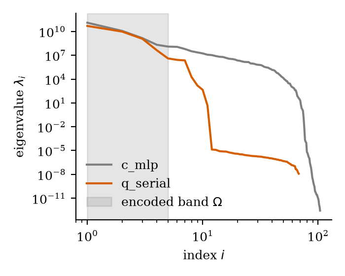
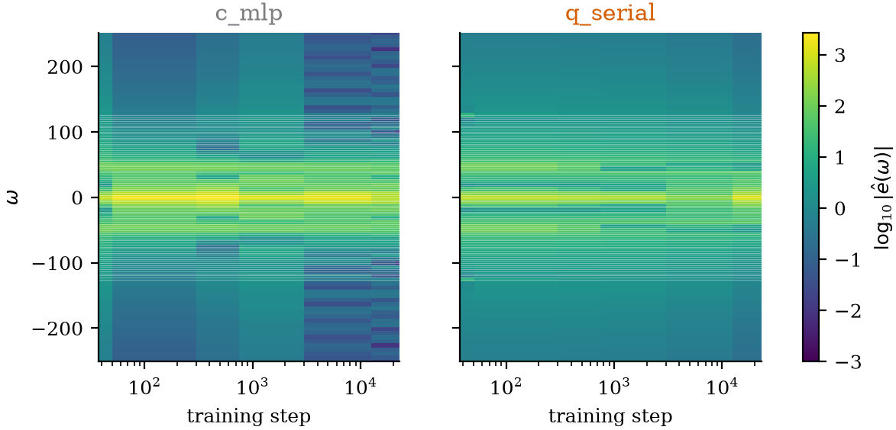

# Spectrum-Matched Quantum-Assisted PINNs

A constructive design methodology for problem-specific variational circuits,
instrumented by explainable-AI diagnostics

Katta Lahari, Mannava Daasaradhi

---

## The problem

A classical PINN learns low-frequency solution components fast and high-frequency
components almost not at all — **spectral bias**.

Its neural tangent kernel (NTK) eigenvalues decay with Fourier-mode index, so residual
and boundary loss terms converge at characteristically different rates.

Prior hybrid quantum-classical PINN work reports empirical accuracy deltas on hand-picked
circuit sizes — no principled way to choose the circuit *given* the PDE.

---

## The one theorem

**Proposition 1 (circuit spectrum).** An $L$-layer data-re-uploading circuit with
encoding generators $H^{(l)}$ realizes

$$f(x) = \sum_{\omega\in\Omega} c_\omega(\theta)\, e^{i\omega x}, \qquad
\Omega = \Big\{\textstyle\sum_{l=1}^{L} (\lambda^{(l)}_a - \lambda^{(l)}_b)\Big\}$$

The circuit's accessible frequency set is **exactly and prescribably determined** by its
data-encoding Hamiltonians' eigenvalues — not a black box.

---

## Ternary scaling: exponential spectral richness

Set $\omega_l = \Delta\cdot 3^{l-1}$. Then $\Omega$ is *exactly* the balanced-ternary
representation of the integers in $[-\tfrac{3^L-1}{2}, \tfrac{3^L-1}{2}]$ — **$3^L$
distinct frequencies**, no degeneracy.

Linear scaling ($\omega_l=\omega_0$) gives only $2L+1$ frequencies — the design knob
almost every prior re-uploading paper leaves at 1.

| $L$ | ternary reach | linear reach |
|---|---|---|
| 3 | $13\Delta$ | $3\Delta$ |
| 4 | $40\Delta$ | $4\Delta$ |

---

## A correction found along the way (D5)

The depth rule to cover target frequency $K$ at spacing $\Delta$:

$$L = \left\lceil \log_3\!\left(\tfrac{2K}{\Delta}+1\right)\right\rceil$$

**Not** $L=\lceil\log_3(K/\Delta)\rceil$ (missing the factor of 2 and the $+1$).

For P1 ($K=15\pi$, $\Delta=\pi$): uncorrected gives $L=3$, reaching only $13\pi$ —
**silently misses the target mode**. Corrected gives $L=4$, reaching $40\pi$.

Verified by brute-force enumeration before being trusted.

---

## PDE target spectrum (Prop. 2)

For a linear operator with symbol $\sigma(k)$: $\hat u(k) = \hat f(k)/\sigma(k)$.

The target spectral support is computable **before any training run**, from the operator
and forcing alone.

- **Helmholtz**: $\sigma(k)=k^2-|\mathbf k|^2$ → support concentrates near $|\mathbf
  k|\approx k$ — exactly where a classical PINN struggles most.
- **Heat**: $\sigma$ grows with $|\mathbf k|^2$, solution decays exponentially at every
  nonzero mode → support collapses to $k=0$. **The negative control**, predicted a
  priori, not discovered after the fact.

---

## Matching condition & resource bound (Prop. 3)

If $S_\varepsilon \subseteq \Omega$: the hybrid model represents the solution to
$\varepsilon$-accuracy with a **linear** head — architecture choice becomes arithmetic.

$$L \ge \log_3(K/\Delta), \qquad n \ge \lceil d \rceil + n_{\text{cross}}$$

Given $(K,\Delta,d)$ read directly off the PDE, $(L,n)$ follow by formula — not search.

---

## A second correction found along the way (Prop. 4)

**Original claim:** $\Theta_{\text{hyb}} = \Theta_{\text{cl}} + \Theta_q + 2\Theta_\times$

**This is wrong.** NTK is a single Gram sum over the *union* of parameter coordinates.
Classical and quantum parameters are disjoint index sets, so the sum splits additively:

$$\boxed{\Theta_{\text{hyb}} = \Theta_{\text{cl}} + \Theta_q} \quad \text{— no cross term, exactly.}$$

Verified analytically and numerically before trusting it. $\Theta_q$ has eigen-directions
*at* $\Omega$ with eigenvalues bounded below independent of $|n|$ — spectral bias's decay
is replaced by a flat response inside the encoded band.

---

## The design rule: Algorithm 1 (SMCD)

1. **Symbol** — Fourier symbol of the PDE operator
2. **Target** — spectral support from symbol + forcing/BC, before training
3. **Band** — max frequency $K$, resolution $\Delta$
4. **Depth** — $L$ from the corrected D5 rule, ternary scalings
5. **Width** — $n$ qubits from input dimension + cross-terms
6. **Entangler / observable / ansatz / init** — structural barren-plateau mitigation
7. **Report** — every run ships a design card: predicted coverage, correlated against
   measured error

---

## Model families (all size-matched, ±10%)

| Family | Purpose |
|---|---|
| `C-MLP` | the baseline everyone reports |
| `C-FF` | fair classical baseline — random Fourier features |
| `C-RFF-matched` | Fourier features *at the SMCD frequencies* — sharpest ablation |
| `Q-serial` | SMCD-designed hybrid — main model |
| `Q-parallel` | alternate topology |
| `Q-random` | same size, **unmatched** scalings — ablates the design itself |
| `Q-octave` | multi-circuit ensemble for wide bands |

---

## Headline figure: coverage vs. error

SMCD's achieved coverage $|\hat S \cap \Omega|/|\hat S|$ vs. median relative-$L^2$ error —
the direct empirical validation of the design methodology.

---

## NTK spectroscopy: the predicted signature

Classical vs. hybrid eigenvalue spectrum, encoded band $\Omega$ shaded — Prop. 4's
flattened-eigenvalue prediction, measured directly.

---

## Per-frequency error: where the improvement lands

Design card's $\Omega$ overlaid on the classical-vs-hybrid error heatmap — if the improved
band coincides with $\Omega$, the mechanism is demonstrated visually, not just claimed.

---

## The honest negative result

The heat equation (P2) is this project's negative control: SMCD predicts **near-zero
benefit before any training run**, because the diffusive operator's symbol collapses the
target spectrum toward $k=0$.

**Measured:** 3 of 4 quantum families underperform `c_mlp` as predicted (`q_random` by
an order of magnitude); `q_serial` itself is a modest exception (+7.7%, past the 5% bar).
Two classical families (`c_ff`, `c_rff_matched`) also beat `c_mlp`, unrelated to the
quantum-specific claim. The **mechanism** is better supported than the single uniform
5% threshold check (REFUTED on the literal number, mostly right on the per-family story).

---

## What we found

At the sample size this run achieved (**n=2 seeds, not the pre-registered n=5** — cut
under the submission deadline), **the quantum-advantage hypothesis is not supported**:
on Poisson, the one problem with a full four-family ablation, `q_serial` underperforms
`c_mlp`, `c_ff`, and `c_rff_matched` alike. The NTK-flattening (C2) and spectral-bias
(C3) mechanisms proposed to explain *why* it should help point the wrong direction or
hold on only one of two checked instances (C3: confirmed on Poisson, refuted on
Helmholtz\_k10 — no improvement exists there to attribute to anything).

What does hold up: the negative-result mechanism above, one genuine per-frequency win
(Poisson), and — most solidly — the pre-registered, mechanically-adjudicated protocol
itself: all 12 predictions resolved, no `?` left, and it caught real bugs in its own
supporting code along the way. Full breakdown: `FINDINGS.md`.

---

## Recommendations: when to go quantum

- **Purely diffusive / smoothing problems: don't.** 3 of 4 quantum families measurably
  underperform the classical baseline, one by an order of magnitude.
- **High-wavenumber problems, `q_serial` specifically: not yet demonstrated.**
  Underperformed every classical comparator on the one fully-ablated instance at this
  sample size — re-test at the planned $n=5$ before concluding either way.
- **Any conclusion drawn from $n\le2$ seeds: don't trust a CONFIRMED/REFUTED verdict on
  its own.** The smallest achievable two-sided Wilcoxon $p$ at $n=2$ is $0.5$, not
  $0.0625$ — CONFIRMED is mathematically unreachable at this sample size, independent of
  true effect size.

---

## Limitations, stated plainly

- **Seed count cut under deadline pressure: $n=2$, not the pre-registered $n=5$** —
  the achievable Wilcoxon $p$-floor is $0.5$, not $0.0625$; every ratio-based prediction
  can only resolve to REFUTED or INCONCLUSIVE now, regardless of true effect size
- Simulation only — statevector simulator, cross-checked to $<10^{-10}$ against PennyLane;
  no physical hardware
- $\le 8$ qubits — a classical-simulation-cost limit, not a limit of the design rule
  itself
- Noise models are analytic surrogates; density-matrix validation not completed this run
- Affine-encoder constraint (D3) is a real expressivity restriction, imposed to keep the
  coverage metric well-defined
- `predicted_benefit` is a heuristic, not a proven bound
- PR-10 (barren-plateau decay rate) unmeasurable this run — `depth_sweep`'s cut grid has
  no $n_{\text{qubits}}$ variation left to fit a slope against

---

# Thank you

Code, derivations, and reproduction instructions: see the repository.

Every figure in this talk regenerates from committed `results/runs/` data via
`python tasks.py figures` — nothing here is a live model or a checkpoint reload.
